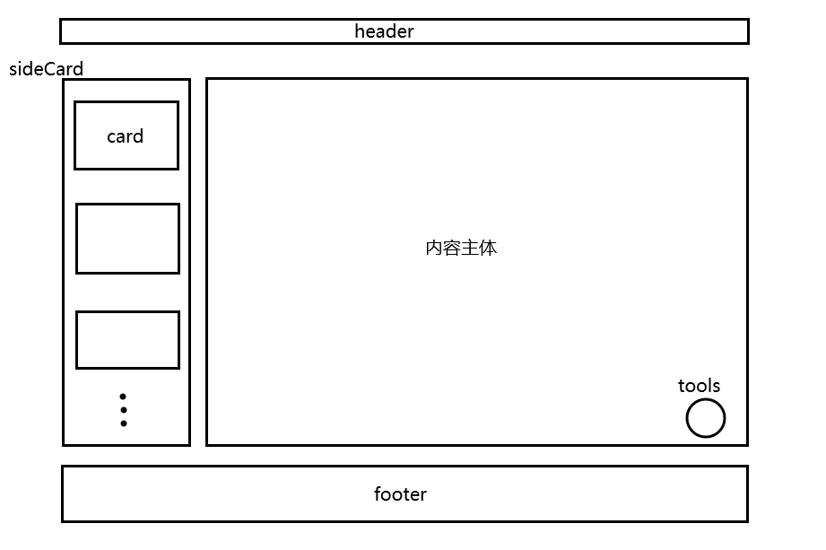
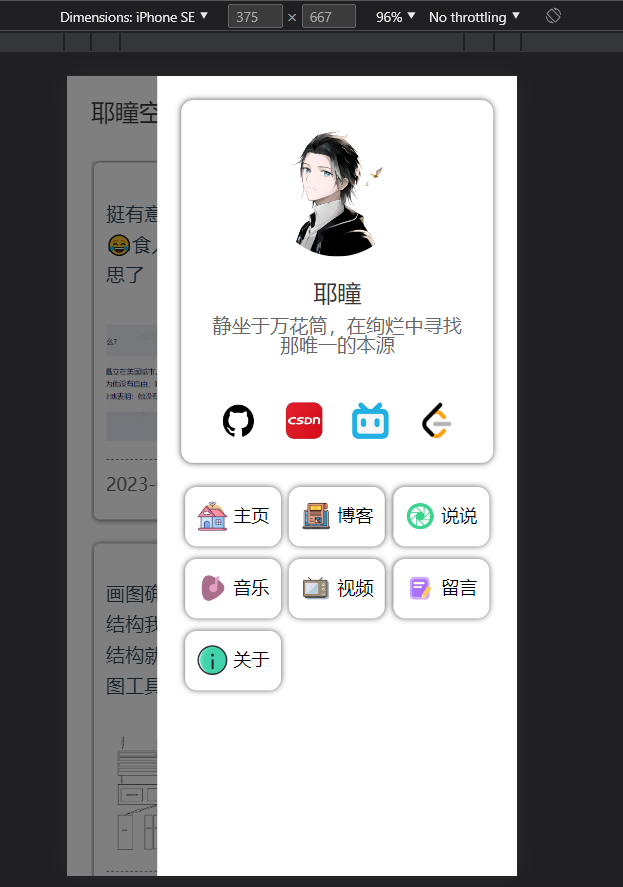

# 一：关于UI

UI是模仿了很多网站：
+ 整体设计主要是模仿Hexo的Butterfly主题样式，这也是我之前网站的主题。包括卡片式布局、顶部导航栏等
+ 说说列表参考了Artitalk、QQ好友动态
+ 博客列表参考了CSDN和Butterfly
+ 音乐界面参考了酷狗App
+ 视频界面参考了Bilibili（虽然一点也不像）

# 二：结构设计

这是个单页面网站，采用卡片式设计，结构图如下：

当然除了这几个部分，在移动端模式下，还有有一个sideBar，如下：

这些结构有各自的形态：
+ Header: 有PC态和mobile态。在页面高度大于窗口时会随滚轮滚动或者屏幕滑动而收起或展开，而页面高度小于窗口固定。
+ SideCard: 作为侧栏卡片盒存在，有PC态和mobile态。
  + 页面可以通过控制器选择自己需要的卡片进行填充
  + 卡片的宽度必须继承卡片盒，由卡片盒实现响应式
  + PC态下默认在页面左边，可以通过Tools结构选择关闭卡片盒或者移动到页面右边
  + mobile态下默认在主体部分底部
+ 主体：展示页面的主体内容，各个页面组件必须继承主体的宽度，又主体实现响应式
+ Footer：有static、fixed两种形态，当检测到页面高度大于窗口时采用static，组件存在于DOM流，否则采用fixed形态，脱离DOM流
+ Tools: 工具箱，进存在于PC端

我设计了一个控制器，也就是hooks里的useProcessControl，页面可以通过执行该控制器选择自己需要的结构，以及选择卡片盒里放哪些卡片

# 三：技术栈

vue3 + ts

这也是我懊悔至今的部分，单页面应用不利于SEO，也就是搜索引擎优化，导致我的网站很难被搜索引擎收录，也就很难收获自然流量。